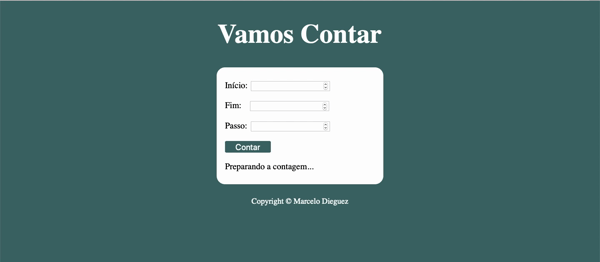

<h1 align="center">Vamos Contar </h1>
 

---

## 🔖 Sobre

Este exercício foi criado para aplicar o conhecimento de **Repetições** em **JavaScript.**

---

## 💾 Tecnologias utilizadas

O projeto foi desenvolvido utilizando as seguintes tecnologias.

- HTML
- CSS
- JavaScript

